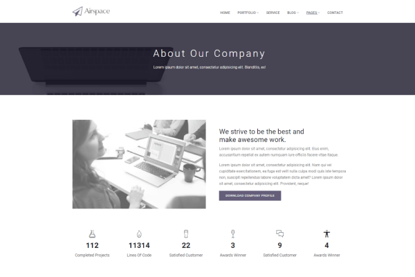
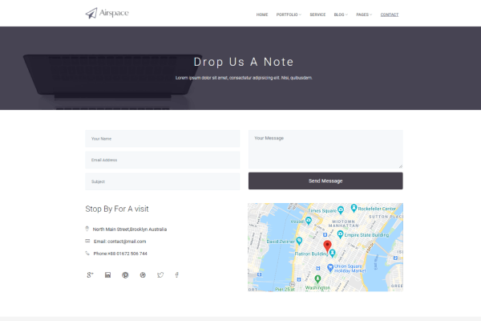

# 🫀 LivMarX — Liver Cirrhosis Stage Classification Using Machine Learning

> **Predicting liver cirrhosis severity from routine blood tests — no CT scan or MRI needed.**


---

## 🔍 Problem Statement

Liver cirrhosis affects **millions of people globally**, yet traditional diagnostic methods rely on expensive imaging techniques like CT scans and MRIs — which are **inaccessible in low-resource settings**.

**LivMarX solves this** by accurately classifying liver cirrhosis stages using only **routine blood test results**, making early diagnosis cheaper, faster, and more accessible.

---

## 🎯 What LivMarX Does

| Input | Output |
|-------|--------|
| Routine blood test report | Cirrhosis Stage: **Mild / Moderate / Severe** |

No imaging. No expensive equipment. Just blood biomarkers.

---

## 📊 Model Performance

| Metric | Score |
|--------|-------|
| **Accuracy** | **87%** |
| **AUC-ROC** | **0.95** |
| Algorithms Tested | 10+ |
| Dataset Size | 424 patients |

> AUC of 0.95 means the model is **highly reliable** in distinguishing between cirrhosis stages — clinical-grade performance.

---

## 📸 Application Screenshots

| Home Page | Login Page |
|-----------|------------|
|  |  |

| Prediction Page | Performance Page |
|-----------------|-----------------|
|  |  |

| About Page | Contact Page |
|------------|--------------|
|  |  |

---

## 🧠 How It Works

```
Patient Blood Test → Data Preprocessing → Feature Engineering → ML Model → Stage Prediction
                                                                     ↓
                                               Mild | Moderate | Severe
```

### Pipeline:
1. **Data Collection** — 424 patients (312 from Mayo Clinic clinical trial + 112 real-world follow-up)
2. **Data Preprocessing** — Handled missing values, outliers, normalization using SMOTE for class balance
3. **Feature Engineering** — Created synthetic variables capturing patient demographics & biomarker correlations
4. **Model Training** — Evaluated 10+ algorithms: Random Forest, XGBoost, LightGBM, Neural Networks, SVM, and more
5. **Hyperparameter Tuning** — GridSearchCV with k-fold cross-validation
6. **Deployment** — Flask web application for real-time predictions

---

## 🛠️ Tech Stack

| Category | Tools |
|----------|-------|
| Language | Python 3.8+ |
| Web Framework | Flask |
| ML Libraries | Scikit-learn, XGBoost, LightGBM, CatBoost |
| Deep Learning | Neural Networks (Fully Connected) |
| Data Processing | Pandas, NumPy, SMOTE (imbalanced-learn) |
| Visualization | Matplotlib, Seaborn |
| Frontend | HTML, CSS, JavaScript |
| Development | Jupyter Notebook, Anaconda |

---

## 🚀 Getting Started

### Prerequisites
```bash
pip install -r requirements.txt
```

### Run the Web App

```bash
# Step 1 — Activate conda environment
conda activate major

# Step 2 — Navigate to project folder
cd FCODE/LIVER/Liver-Cirrhosis-Stage-Prediction-main

# Step 3 — Run the Flask app
python application.py run server
```

Then open your browser at:
```
http://127.0.0.1:5000
```

---

## 📁 Project Structure

```
LivMarX/
├── application.py              # Main Flask application
├── Model Deployment.ipynb      # ML model training & evaluation
├── LivMarX_Training.ipynb      # Model training notebook
├── cirrhosis.csv               # Dataset (424 patients)
├── model.pkl                   # Trained ML model
├── scaler.bin                  # Data scaler for preprocessing
├── requirements.txt            # Python dependencies
├── Procfile                    # Deployment configuration
├── templates/                  # HTML frontend pages
├── static/                     # CSS, JS, images
│   ├── css/
│   ├── js/
│   └── images/
├── screenshots/                # App screenshots
│   ├── homepage.png
│   ├── login page.png
│   ├── prediction.png
│   ├── performance.png
│   ├── about.png
│   └── contact.png
└── README.md
```

---

## 💡 Key Highlights

- ✅ **Non-invasive** — Uses only blood biomarkers, no imaging required
- ✅ **Cost-effective** — Reduces diagnostic cost significantly
- ✅ **High accuracy** — 87% accuracy with 0.95 AUC
- ✅ **Full Stack** — End-to-end Flask web application
- ✅ **Accessible** — Designed for resource-limited healthcare settings
- ✅ **Clinically relevant** — Based on real Mayo Clinic trial data

---

## 🔬 Dataset

- **Source:** Mayo Clinic Primary Biliary Cirrhosis Trial
- **Size:** 424 patients
  - 312 controlled trial participants
  - 112 real-world follow-up patients
- **Features:** Blood biomarkers, patient demographics, clinical indicators
- **Target:** Cirrhosis stage (Mild / Moderate / Severe)

---

## 🔮 Future Enhancements

- Integration of genetic biomarkers for deeper insights
- Real-time clinical decision support system
- SHAP values for model explainability
- Expansion to broader, more diverse patient populations
- Hybrid ML + statistical modeling approaches


---

## 📚 References

This project is backed by 16 peer-reviewed research papers from journals including:
- *Nature Reviews Gastroenterology & Hepatology*
- *The Lancet*
- *IEEE Transactions on Biomedical Engineering*
- *IOP Conference Series*

---

## 📜 License

This project was developed as a Final Year B.Tech project at GNITC, Hyderabad under JNTU.

---

<p align="center">
  <b>⭐ If you found this project useful, please give it a star!</b><br>
  Made with ❤️ for accessible healthcare diagnostics
</p>
